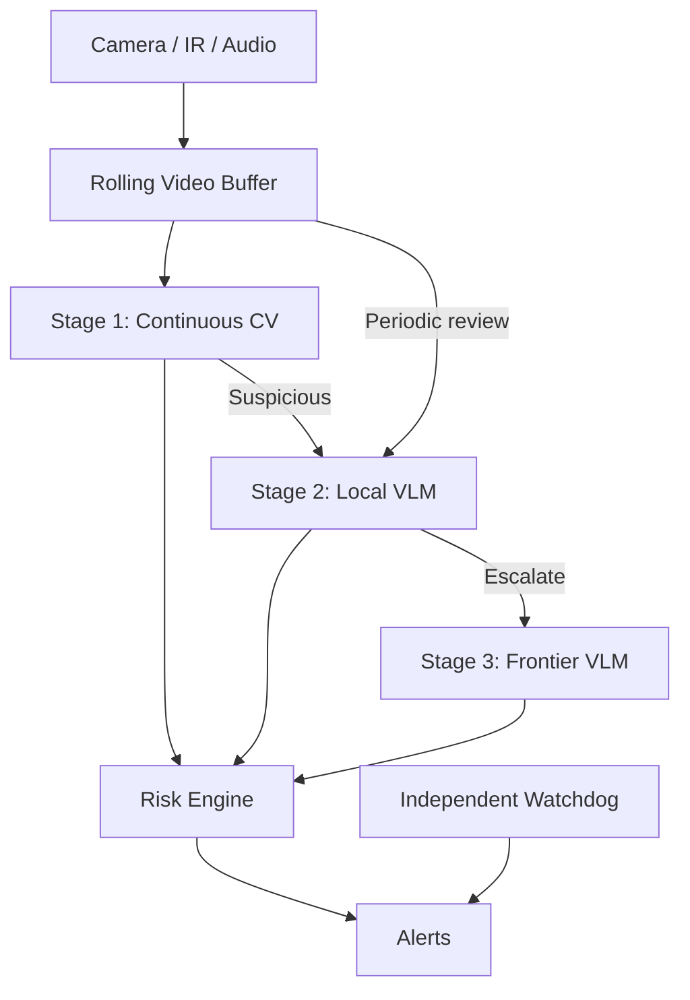

# Vision Sentinel

A hierarchical AI monitoring system for continuous camera streams.

I started this project for a specific reason: I wanted an additional safety layer for monitoring my baby at night.

Traditional camera monitors still depend on someone actively watching. Modern computer vision and vision-language models can do more: continuously observe a scene, detect unusual situations, reason about what happened, and escalate when something deserves attention.

The baby-monitor use case is the starting point, but the architecture is intentionally general enough for pets, home security, elderly monitoring, machinery, wildlife cameras, or other always-on camera applications.

> **Vision Sentinel is not a medical device and should not replace supervision, appropriate safety practices, or medical monitoring.**

## Architecture

The core idea is simple: **use cheap specialized models continuously, and increasingly capable models only when needed.**



### Stage 1 — Continuous CV

Small models run continuously at high frame rates and produce structured observations.

For the initial baby-monitor configuration:

* baby / face detection
* nose and mouth visibility
* body pose
* blanket and object segmentation
* object proximity to the face
* motion and respiration-like chest movement
* camera obstruction and image quality

Example:

```text
baby_detected = true
face_visible = true
mouth_nose_visible = true
pose = supine
blanket_face_overlap = 0.03
respiration_motion_present = true
```

Stage 1 detects **known observable conditions** cheaply and continuously.

### Stage 2 — Local VLM

A local multimodal model such as Qwen provides semantic understanding.

It has two independent jobs:

1. **Triggered review** — inspect video around a suspicious CV event.
2. **Retrospective review** — periodically review recent footage for anything the specialized detectors may have missed.

This second path is important: a missed CV trigger should not automatically mean a missed event.

### Stage 3 — Frontier VLM

Ambiguous or higher-risk events can be escalated to a stronger cloud model such as Gemini.

This stage runs rarely, keeping most processing local while still allowing access to frontier-level video reasoning when useful.

Models should remain replaceable as better options become available.

## Escalation is not voting

Higher-level models should add evidence, not necessarily veto lower-level alerts.

A high-confidence critical detector can alert immediately while Qwen and Gemini analyze the event in parallel:

```text
critical CV signal
    ├──> alert
    ├──> local VLM review
    └──> frontier VLM review
```

The system should prefer an occasional false positive over silently suppressing a potentially important event.

## System health

The AI pipeline should not be responsible for deciding whether the AI pipeline itself is alive.

A separate deterministic watchdog should monitor things such as:

```text
camera.last_frame_age
camera.fps

cv.last_inference_age
cv.latency

local_vlm.available
cloud_vlm.available

disk.free_space
notification_service.available
```

Failures such as a dead camera feed or stalled CV process should generate alerts independently of Qwen or Gemini.

Eventually, the watchdog may run on separate hardware so failure of the primary machine does not also disable monitoring.

An optional coding/operations agent could sit above this layer to inspect logs, diagnose failures, restart allowlisted services, and verify recovery—but it should not autonomously change safety thresholds or disable alerts.

## Canary testing

A healthy process can still produce bad results.

Vision Sentinel should periodically run known test clips through the actual pipeline:

```text
test video
  ↓
decoder
  ↓
CV / VLM
  ↓
risk engine
  ↓
expected result
```

This tests actual behavior rather than just checking whether a process returns `200 OK`.

## Initial use case: baby monitoring

The first implementation will focus on nighttime monitoring for observable conditions such as:

* persistent face obstruction
* bedding or objects near the face
* unusual body positions
* unexpected objects or people
* prolonged lack of movement
* loss of visible respiration-like motion
* camera or monitoring failure

Existing infant-specific research models for pose estimation, crib hazards, and video-based respiration may provide useful starting points.

Visual monitoring cannot reliably determine oxygen saturation, airway patency, or whether an infant is medically safe; those are outside the scope of this project.

## Generalizing the system

The core pipeline should be independent of the monitoring domain.

A monitor configuration defines:

1. what signals matter
2. which models produce them
3. what counts as suspicious
4. what context the VLM receives
5. how risk is scored
6. when humans are alerted

Potential future configurations include baby, pet, security, elderly, wildlife, and equipment monitoring.

Vision Sentinel also does not need to become another full NVR. Mature projects such as Frigate already handle RTSP ingestion, recording, motion detection, hardware acceleration, and camera management well. Ideally, Vision Sentinel can integrate with those systems and focus on **reasoning, escalation, and reliability**.

## Current status

Very early.

The initial roadmap:

* [ ] Camera / RTSP input and rolling buffer
* [ ] Continuous CV pipeline
* [ ] Local Qwen video inference
* [ ] Triggered VLM review
* [ ] Periodic retrospective review
* [ ] Risk engine
* [ ] Notifications
* [ ] Frontier-model escalation
* [ ] Independent watchdog
* [ ] Canary tests
* [ ] Baby-monitor configuration
* [ ] IR / night-vision evaluation
* [ ] Measure false positives and false negatives
* [ ] Generalize the monitor interface

## Design principles

* **Local first** — keep most footage and inference local.
* **Models are fallible** — no single model is an oracle.
* **Cheap perception before expensive reasoning.**
* **Independent detection paths reduce common failure modes.**
* **Fail loudly** — monitoring failures should never look healthy.
* **Human escalation is the goal**, not autonomous judgment.

## Why I'm building this

The immediate motivation is practical: I want something watching the camera at 3 a.m. when I'm asleep.

The broader question is more interesting:

> **What does a reliable always-on AI perception system look like when we assume every individual model can fail?**

Vision models are becoming capable enough for continuous semantic understanding of the physical world. I want to explore the reliability architecture that makes that useful in practice.
